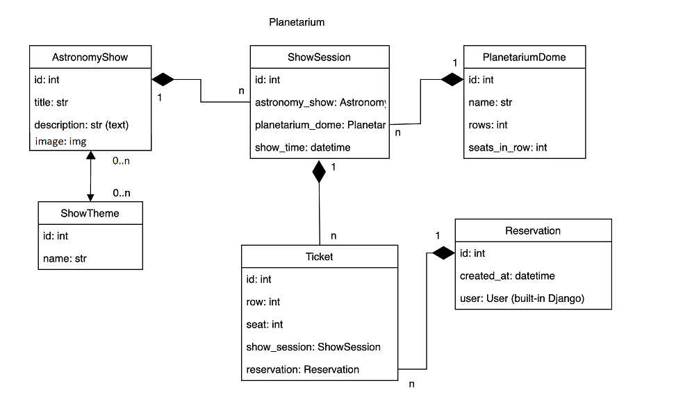

# planetarium_api_service


Django project for managing planetarium API service


Welcome to the Planetarium API service! 
This application allows you to CRUD operations of ShowTheme, PlanetariumDome, 
AstronomyShow, ShowSession, Reservation models, keep track of shows, 
reservations and show schedule in your planetarium.

- Download [ModHeader](https://chrome.google.com/webstore/detail/modheader/idgpnmonknjnojddfkpgkljpfnnfcklj?hl=en)
- To get started, users need to register and get JWT token.
- Also, you can use this superuser after loading data from JSON file (of course you should create a JWT token and use ModHeader in format (Authorization Bearer your_access token)
- email: admin.user@cinema.com
- password: pbkdf2_sha256$320000$oZqdjfUqKC500V7kk3kMmb$TBVlOMhfJxWrxbUnNpWZK0+rYM242g7do/YM5tkhn+M=
- Default life-time of access token — 30 min, refresh token — 1 day.

Once registered, you can reserve seats at the planetarium,
view show sessions and information about different shows. 
But you can see only yours reservations and of course you can delete them.
You can also perform all data manipulations through the admin panel.


Also, you have documentations to all endpoints of the API (swagger or redoc).


## Installation

Python3 must be already installed

For Windows:
```shell
git clone https://github.com/Kurta97/planetarium_api_service.git
cd planetarium_api_service
python venv venv
venv\Scripts\activate
pip install -r requirements.txt
python manage.py makemigrations
python manage.py migrate
python manage.py loaddata planetarium_service_db_data.json
python manage.py runserver
```
For Mac (and Linux):
```shell
git clone https://github.com/Kurta97/planetarium_api_service.git
cd planetarium_api_service
python3 -m venv venv
source venv/bin/activate
pip install -r requirements.txt
python manage.py makemigrations
python manage.py migrate
python manage.py loaddata planetarium_service_db_data.json
python manage.py runserver
```

## Features

- Only authenticated users can create reservations and add tickets and view API info
- Anonymous users can do only 10 requests per minute.
- Authenticated users can do 30 requests per minute.
- Create a show theme
- View a show theme list and detail
- Edit a show theme
- Delete a show theme
- Create a planetarium dome
- Edit a planetarium dome
- Delete a planetarium dome
- View a planetarium dome list and detail
- Create an astronomy show
- Add image to astronomy show
- View an astronomy show list and detail
- Edit an astronomy show
- Delete an astronomy show
- Create a show session
- Add astronomy show to show session
- View a show session list and detail
- Edit a show session
- Delete a show session
- Create a ticket
- Edit a ticket
- Delete a ticket
- View a ticket info
- Add ticket to reservation
- Delete ticket from reservation
- Create a reservation
- Edit your reservations
- Delete a reservation
- View your reservation list or detail
- Add astronomy show and planetarium dome to reservation
- Delete astronomy show and planetarium dome from reservation
- You can use the service only after registration and only with active JWT token


## DB structure

